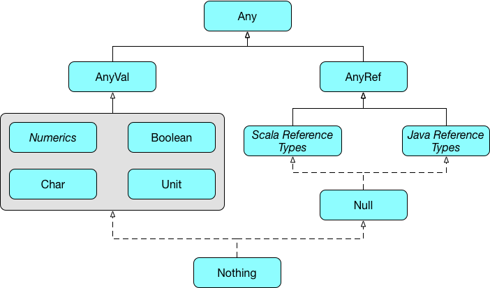

# The Type System

Now that you've seen how to create and use classes, let's take a few minutes to look at Scala's type system.

One of the characteristics of functional languages is that they tend to think a lot about types, and have type systems that let you give a lot of information to the compiler. Scala has to work within the constraints of what the JVM will allow, but it tries to have as complete a type system as possible.

## Value and Reference Types
There are two fundamental categories of types in Scala - value types and reference types, represented by `AnyVal` and `AnyRef` respectively.

### Reference Types

I> For those who know Java, `AnyRef` is equivalent to `java.lang.Object`, and so acts as the superclass for both Scala and Java reference types.

### Value Types

`AnyVal` is the base for all types that are not implemented as objects. The standard implementation includes nine value types:

   * `Byte`, `Short`, `Int`, `Long` and `Char` are the integer value types
   * `Float` and `Double` are the floating point value types
   * `Boolean` is the logical value type
   * `Unit` is the void type

### The Any Type

Uniting `AnyRef` and `AnyVal`, right at the top of Scala's type hierarchy, is `Any`.

I> Java programmers may be wondering how `Any` can be the superclass of `AnyRef`, if `AnyRef` is basically `java.lang.Object`. It is true that `Object` is the top of the hierarchy as far as JVM languages are concerned, and so `Any` is a feature of Scala alone. It is a compile-time type, and isn't present at runtime.

## Nothing and Null

Finally, we come to two rather strange types: `Nothing` and `Null`. 

Let's start with `Null`. This type sits 'below' the reference types in the hierarchy, and so it is a subclass of every reference type. Its job is to provide a type to represent a null reference, and it only has a single instance, `null`. Since `Null` is a subtype of every reference type, you can assign `null` to any reference.

~~~~~~~~
scala> null
res10: Null = null

scala> class Foo
defined class Foo

scala> val f: Foo = null
f: Foo = null
~~~~~~~~

T> The presence of `Null` helps make the type system complete, but we try not to use nulls in Scala programming. We'll talk more about this when we discuss functional programming.

`Nothing` is a strange type, because it can't have any instances. Its purpose is to represent... nothing. Why do we need such a thing? It turns out that it is necessary if our type system is to be complete.

Here are a couple of examples. Firstly, consider the empty list, List[]. What is this a list *of*? It has to be a list of something!

~~~~~~~~
scala> val l = List()
l: List[Nothing] = List()
~~~~~~~~

The answer is that it is a list of `Nothing`.

Secondly, we know that everything in Scala is an expression that has a type. Suppose you have a function that will never return: what is its return type? Or what is the type of `throw new Exception()`? They have the type `Nothing`.

You probably won't use `Nothing` yourself very often, if at all, but it needs to be there.