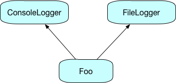

# Inheritance and Traits
If you have met inheritance in other OO languages such as Java or C#, then the inheritance model used by Scala will be familiar. These languages also support the idea of *interfaces*, which in Scala have been replaced by *traits*.

I'm assuming that readers have a basic understanding of OO, including the ideas of inheritance, abstract types and interfaces. If that isn't the case, read the following section and follow up on some of the references.

### A Brief Overview of Inheritance
This section provides a brief discussion of inheritance; feel free to skip over it if you are comfortable with OO programming. If you want more detail, there has been a lot written on the subject! See [Head First OO Analysis and Design](http://shop.oreilly.com/product/9780596008673.do)

In programming languags, inheritance gives us a way to express the "is a" relationship. For example, a `Car` is a `Vehicle`, a `SavingsAccount` is an `Account`, and a `Manager` is an `Employee`.

T> The parent and child classes will often be called the *superclass* and *subclass*, or *base class* and *derived class* if you come from C++.

Inheritance tells the compiler how classes are related: if a `Car` is a `Vehicle`, then a function that requires a `Car` will accept a `Vehicle`. This principle of *substitutability* lets developers write software that models the world, and helps make it extensible.

There are a couple of important points to note when designing inheritance relationships. If a `Car` is a `Vehicle`, then it must do everything that a `Vehicle` can do. It is allowed to add new functionality and redefine how existing functionality works, but it is not allowed to remove functionality... because if it does, it isn't really a `Vehicle`.

The second point is bear in mind is that you should only use inheritance where you really do want an "is a" relationship. For example, a stack can be implemented using a linked list, but you probably don't want to say that a stack is a linked list, because you can add items to both ends of a list as well as insert them in the middle. What you probably want to do is to implement the stack *using* a linked list... but that is different to being one, and doesn't imply anything extra to the user.

Like other languages that run on the JVM, Scala supports inheritance from a single concrete superclass. Some other languages, in particular C++, allow inheritance from more than one concrete superclass, but JVM languages do not.

This means that if you want to model a `SeaPlane`, you can't simply inherit from both `Plane` and `Boat`. However, Scala has introduced the idea of *traits*, which provide an elegant way to do this.

## Inheritance
Because it runs on the JVM, Scala follows the Java model, with classes inheriting from a single superclass. And like in Java, the relationship is expressed using `extends`:

~~~~~~~~
scala> class Person
defined class Person

scala> class Employee extends Person
defined class Employee

scala> val e1 = new Employee
e1: Employee = Employee@2f333739

scala> val p1: Person = e1
p1: Person = Employee@2f333739
~~~~~~~~

As you'd expect, since a, `Employee` is a `Person`, you can get a `Person` reference to an `Employee` object.

### Calling Superclass Constructors
You will often need to pass values to the constructor of a superclass, and this is a straightforward extension of the way you create simple classes.

~~~~~~~~
scala> class Person(val name: String)
defined class Person

scala> class Employee(name: String) extends Person(name)
defined class Employee
~~~~~~~~

The `extends` clause specifies the superclass constructor, and passes values from the subclass constructor argument list. Note, however, that `Employee` doesn't qualify `name` with `val`, because it isn't going to be a field in `Employee` but is simply an argument that gets passed through to `Person`.

### Overriding Methods
As you'd expect, a subclass can override methods that it inherits from its superclass. Here is a class that override the default implementation of `toString`:

~~~~~~~~
scala> scala> class Person(val name: String) {
     | override def toString = "Name: " + name
     | }
defined class Person

scala> val p1 = new Person("fred")
p1: Person = Name: fred
~~~~~~~~

Now, when you create a `Person`, the compiler will display the result of calling `toString` on the object. The result is a lot more useful than the default!

The `override` keyword is required, so that the compiler knows what you are trying to do. Failing to provide it gives an error, as does putting `override` on a method that isn't overriding anything:

~~~~~~~~
scala> class Person(val name: String) {
     | def toString = "Name: " + name
     | override def fooo = "nothing"
     | }
<console>:8: error: overriding method toString in class Object of type ()String;
 method toString needs `override' modifier
       def toString = "Name: " + name
           ^
<console>:9: error: method fooo overrides nothing
       override def fooo = "nothing"
~~~~~~~~

This is useful information, since typing errors can mean that you may not specify an override at all, or worse, accidentally override the wrong method.

### Overriding `def` and `val`
We've already talked about the difference between declaring something as `def` or `val`: a `val` is evaluated the first time it is encountered, while a `def` is re-evaluated each time it is used. This is why it makes sense to use `def` when defining functions, because the whole point is to evaluate them each time they're called.

Suppose, though, that we have this situation:

~~~~~~~~
scala> class Person(val name: String) {
     | def age = calculateAge()
     | }

scala> class AlwaysYoung(val name: String) extends Person(name) {
     | override val age = 21
     | }
~~~~~~~~

The `Person` class defines `age` as a `def`, which is evaluated each time because people gradually grow older. The `AlwaysYoung` class fixes the age at 21, and so it makes sense to define this as a `val`, since it never changes. This is sensible, because `age` in the superclass can return any value, while the override in the subclass restricts it to one value.

It should also seem reasonable that the opposite is not true. If a class has defined a member as a `val`, then clients will expect a single fixed value. Overriding this with a `def` implies that different values may be returned from different calls, which is breaking the contract. And sure enough, if you try this you will get a compiler error:

~~~~~~~~
scala> class P1(val name: String) {
     | val age = 42
     | }
defined class P1

scala> class N1(name: String) extends P1(name) {
     | override def age = 21
     | }
<console>:9: error: overriding value age in class P1 of type Int;
 method age needs to be a stable, immutable value
       override def age = 21
~~~~~~~~

## Traits
Anyone who has developed in a 'modern' OO language will be familiar with the idea of an interface, a way of specifying behavior without implementing it. Here's a simple example in Java:

~~~~~~~~
interface Printable {
  void print();
}
~~~~~~~~

The `Printable` interface defines one method, `print` that takes no arguments. Any type that wants to be a `Printable` needs to implement a method with the same signature.

Where classes model the *is a* relationship, interfaces model a *can do* relationship that focusses on ability. For example, you can print both invoices and images, even though those classes may not be related.

Scala's equivalent of interfaces are called *traits*, and they differ from interfaces in several ways

* Traits can contain default implementations of methods
* They can also contain abstract and concrete fields
* They can extend other traits and classes
* Classes can use multiple traits
* Traits can be added to objects at creation time
* They can require that classes using them implement particular behavior
* They solve the "[diamond inheritance](https://en.wikipedia.org/wiki/Multiple_inheritance)" problem

Traits are very important, and it is fair to say that if you are going to consider yourself a Scala programmer, you need to have a good understanding of traits and how they work.

If you look at the Scala documentation, you can see just how much traits are used.

{width=60%}

Each of the T's denotes a trait type, so you can see how the collections are built from traits and objects.

Although you can use traits like interfaces, implementing all the members yourself, Scala uses traits to add behaviour to classes.

T> The term many Scala programmers use is *mix-in*, using traits to mix behavior into classes.

Used in this way, traits provide a way to implement multiple inheritance without running into the problems you get when inheriting from classes.

### Defining and Using Traits
Traits allow you to specify behavior, but you can also provide default implementations for methods. This is really useful where a trait may contain lots of methods, many of which can have sensible defaults, and makes the job of using the trait a lot simpler.

Here's an example of a trait defining shapes. It has fields and an implementation of the `move` method, but leaves implementing `area` up to classes that use it.

~~~~~~~~
trait Shape {
  private var x = 0
  private var y = 0

  def position = (x, y)
  def position(xp: Int, yp: Int): Unit = {
    x = xp
    y = yp
  }

  def move(dx: Int, dy: Int): Unit = {
    x += dx
    y += dy
  }

  def area(): Double
}
~~~~~~~~

You could use this trait to create a `Circle` class, using the `extends` keyword:

~~~~~~~~
class Circle(val radius: Int) extends Shape {
  def area = Math.PI * radius * radius
}
~~~~~~~~

`Circle` has added `radius` as a property and defined the `area` method, but inherits everything else from `Shape`

~~~~~~~~
scala> val c1 = new Circle(5)
c1: Circle = Circle@304b71a5

scala> println(c1.position)
(0,0)

scala> c1.move(3,4)

scala> println(c1.position)
(3,4)

scala> println(c1.area)
78.53981633974483
~~~~~~~~

Traits cannot be instantiated, but only mixed into other types. This means that you can't use `new` to create an instance of a trait. Traits also cannot have constructor parameters, so you have to pass values through the implementing type:

~~~~~~~~
class Circle(val radius: Int, xp: Int = 0, yp: Int = 0) extends Shape {
  position(xp, yp)

  def area = Math.PI * radius * radius
}
~~~~~~~~

The `Circle` optionally accepts position values and then uses the `position` method to set them.

Of course, it is possible for a class to use more than one trait at a time. Consider the following two simple traits:

~~~~~~~~
trait Flying {
	def fly = println("I can fly!")
}

trait Swimming {
  def swim = println("I can swim!")
}
~~~~~~~~

Seabirds, such as seagulls, can both fly and swim, and so would want to implement both traits. And, of course, since you have an implementation in a base trait, you can override it:

~~~~~~~~
class Seagull extends Flying with Swimming {
  override def fly = println("Flying!")
}
~~~~~~~~

The `extends` keyword is used for the first trait, and `with` is used for subsequent traits. If you have more than two traits, just add more `with` clauses (e.g. `class Foo extends A with B with C`)

### Trait Linearization
Suppose that you use a trait to define a logging mechanism, like this:

~~~~~~~~
trait Logger {
  def log(msg: String)
}

trait ConsoleLogger extends Logger {
  def log(msg: String) { println(msg) }
}

trait FileLogger extends Logger {
  def log(msg: String) { println("file: " + msg) }
}
~~~~~~~~

Th `ConsoleLogger` and `FileLogger` traits both implement the `log` method, and you can use them like this:

~~~~~~~~
class Foo extends ConsoleLogger {
  def doIt = log("doing something")
}
~~~~~~~~

What happens if you want to log both to the console and to a file? If you try using both traits, you'll get an error:

~~~~~~~~
scala> class Foo extends ConsoleLogger with FileLogger {
     | def doIt = log("Doing something")
     | }
<console>:10: error: class Foo inherits conflicting members:
  method log in trait ConsoleLogger of type (msg: String)Unit  and
  method log in trait FileLogger of type (msg: String)Unit
(Note: this can be resolved by declaring an override in class Foo.)
       class Foo extends ConsoleLogger with FileLogger {
             ^
~~~~~~~~

The problem here is that `Foo` has inherited two concrete implementations of `log`, and the compiler doesn't know which one to use.

One solution to this problem is to use `override` when defining the traits:

~~~~~~~~
trait Logger {
  def log(msg: String)
}

trait ConsoleLogger extends Logger {
  override def log(msg: String) { println(msg) }
}

trait FileLogger extends Logger {
  override def log(msg: String) { println("file: " + msg) }
}
~~~~~~~~

You'll now find that the code compiles, and will run:

~~~~~~~~
scala> class Foo extends ConsoleLogger with FileLogger {
     | def doIt = log("Doing something")
     | }
defined class Foo

scala> val f = new Foo
f: Foo = Foo@64b8f8f4

scala> f.doIt
file: Doing something
~~~~~~~~

But here's an interesting thing: switch round the order of the two traits in the class definition, and run the code again:

~~~~~~~~
scala> class Foo extends FileLogger with ConsoleLogger {
     | def doIt = log("Doing something")
     | }
defined class Foo

scala> val f = new Foo
f: Foo = Foo@6bdf28bb

scala> f.doIt
Doing something
~~~~~~~~

The first version obviously invoked `log` in the `FileLogger`, while the second one invoked `log` in `ConsoleLogger`.

This is an example of *trait linearization* in action. In many languages that support multiple inheritance, the inheritance tree for `Foo` would look like this:

`Foo` would have two equivalent implementations of `log`, and the compiler wouldn't know which one to use. In contrast, Scala looks at it like this:

When resolving which implementation to use, Scala starts at the far end of the chain of traits, and uses the first one it finds. This explains why you get a different result when you change the order of the traits.

### Adding Traits at Object Creation Time

Trait linearization also lets you do something that is very neat. Suppose that you want to add another kind of logger, maybe one that sends an SMS message:

~~~~~~~~
trait SMSLogger extends Logger {
  override def log(msg: String) { println("sms: " + msg) }
}
~~~~~~~~

The `Foo` class has two kinds of logging built in, so how can you use this new logger without editing code and recompiling? Like this...

~~~~~~~~
scala> val f1 = new Foo with SMSLogger
f1: Foo with SMSLogger = $anon$1@d2cc05a

scala> f1.doIt
sms: Doing something
~~~~~~~~

Using `with`, you can add a trait when you create an instance, effectively adding another item to the far end of the inheritance chain. Note the type of the instance: this isn't now a `Foo` but a `$anon$1`, a type that has been created for you.

If you've done anything with unit testing and mocking, this should strike you as useful. How about being able to say

~~~~~~~~
val ds = new DataService with MockDAO
~~~~~~~~

### Layering Traits
-- chaining traits so that one trait invokes a method in another

### Placing Requirements on Implementing Classes

## Abstract Types
As you might also expect, Scala supports abstract classes and methods, and it has a few additions above and beyond what you may be used to in other languages.

You can create an abstract class by simply adding the `abstract` modifier to a class definition:

~~~~~~~~
scala> abstract class Shape
defined class Shape

scala> val s = new Shape
<console>:8: error: class Shape is abstract; cannot be instantiated
       val s = new Shape
~~~~~~~~

You can, of course, extend abstract classes and override methods that they define:

~~~~~~~~
scala> abstract class Shape(xPos: Int, yPos: Int) {
     |  private var xp = xPos
     |  private var yp = yPos
     |
     |  def x = xp
     |  def y = yp
     |
     |  def move(dx: Int, dy: Int) {
     |    xp += dx
     |    yp += dy
     |  }
     |
     |  // area() is abstract
     |  def area(): Double
     |}
defined class Shape

scala> class Circle(xPos: Int, yPos: Int, val radius: Int) extends
  Shape(xPos, yPos) {
     |
     |  def area(): Double = Math.PI * radius * radius
     |}
defined class Circle

scala> val c1 = new Circle(10, 10, 3)
c1: Circle = Circle@7f86313a

scala> c1.area()
res0: Double = 28.274333882308138
~~~~~~~~

An abstract method is defined without a body, but you don't need to indicate that it is abstract in any way: the absence of a body tells the compiler what it needs to know. Note that you don't need to use `override` when implementing an abstract method.

When would you choose to use an abstract class over a trait, given that they can both be used as superclasses? There are two possible reasons, one reasonably obvious and one less so.

The obvious reason to use an abstract class is if your abstract supertype requires constructor parameters, because you can't specify these for traits.

The second reason is for interoperation with Java, because abstract classes will often be easier to use from Java than traits.

We have just seen an abstract `def`, but you can also create abstract `val` and `var` members as well. The idea of an abstract field may seem strange, but as we've already said, the distinction between `val` and `def` is more concerned with when entities are initialized rather than whether they are fields or methods. Abstract `val` members can be useful in traits, providing a way to initialize `val`s in traits where you would use constructor parameters in classes.

A final thing to note is the idea of an *abstract type*, shown in the following example:

~~~~~~~~
scala> trait Adder {
     |   type T
     |   def transform(value: T): T
     | }
defined trait Adder

scala> class UseStrings extends Adder {
     |   type T = String
     |   def transform(value: T) = value + value
     | }
defined class UseStrings
~~~~~~~~

The trait `Adder` defines an abstract type `T` along with a `transform` method that uses the type. The concrete class `UseStrings` completes the definition of `T`, and then uses it.

You may be wondering when you might use abstract types rather that generic classes. The short answer is that most of the time you can use either to get the same effect, but there are some cases where they can be preferable. You can find a discussion on the topic [here](http://www.artima.com/forums/flat.jsp?forum=106&thread=270195).
