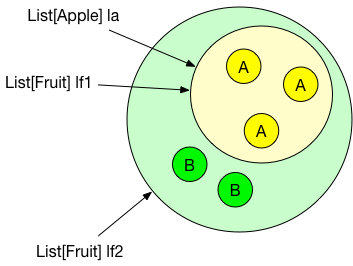

-# Part 5 - Generics and Collections

# Generics

Most, if not all, OO programming languages support the concept of *generic types*, and Scala supports generic classes and traits.

We're not going to talk about generics in great detail here, but just introduce enough so that the discussion of collections will make sense.

### What are Generic Types?
If you're familiar with generic types in another language such as Java, you can skip this section.

When considering data structures in any language, you quickly realize that the operation of a data structure is independent of what it contains: a list of integers supports the same operations (and works in exactly the same way) as a list of strings, and the only difference is the contained type.

~~~~~~~~
class MyListOfInt {
  def add(item: Int) = ...
  def get(index: Int): Int = ...
}

class MyListOfString {
  def add(item: String) = ...
  def get(index: String): String = ...
}
~~~~~~~~

Generics let you create a class with a 'marker' (called a *type parameter*) that represents any type. So you could define and use `MyList` like this:

~~~~~~~~
class MyList[T] {
  def add(item: T) = ...
  def get(index: Int): T = ...
}

val lst = new MyList[Int]
~~~~~~~~

I> It is common in Scala to use single letters, commonly `A` or `T`, for type parameters.

You can, of course, have more than one type parameter. Consider the case of a map or dictionary, where the key and value may be of any type. You could define a map class as `class Map[K, V]`, where `K` is the key type and `V` is the type of the value.

Generic types are very often used for container classes, but you'll see them used in a lot of other places as well.

### Implementing Generic Types

Unlike many other languages, Scala uses square brackets when defining generic types. Here's a very simple generic class:

~~~~~~~~
scala> class Holder[T](val theValue: T)
defined class Holder

scala> val v1 = new Holder(1)
v1: Holder[Int] = Holder@3b26afbc

scala> val v2 = new Holder("abc")
v2: Holder[String] = Holder@6222a343

scala> v1.theValue
res34: Int = 1

scala> v2.theValue
res35: String = abc
~~~~~~~~

The `[T]` defines `Holder` as being a generic class, with `T` as the type parameter. You can, of course, have more than one type parameter, but we'll restrict dicusssion to one parameter for now. The class also has a single field, `theValue`, of type `T`. You can see how creating a `new Holder(1)` results in a `Holder[Int]`, the type parameter being deduced by the compiler.

You will also see classes such as `Holder` described as *type constructors*. In the same way that a non-generic class lets you create objects, a generic class lets you create types, such as `Holder[Int]`.

## Variance
(You can skip this on first reading - it contains more advanced material that explains how things work, but isn't necessary in order to start using Scala collections)

Generics are relatively simple until you start using them with inheritance. If `Employee` is a subtype of `Person`, should you be able to think of a `List[Employee]` as a `List[Person]`?

This may or may not be what you want, and the default is not to allow it. We can see this in a simple code example.

~~~~~~~~
scala> class Holder[T](val theValue: T)
defined class Holder

scala> class Person
defined class Person

scala> class Employee extends Person
defined class Employee

scala> val h1 = new Holder(new Employee)
h1: Holder[Employee] = Holder@3339ad8e

scala> val h2: Holder[Person] = h1
<console>:11: error: type mismatch;
 found   : Holder[Employee]
 required: Holder[Person]
Note: Employee <: Person, but class Holder is invariant in type T.
You may wish to define T as +T instead. (SLS 4.5)
       val h2: Holder[Person] = h1
                                ^

scala>
~~~~~~~~

Defining the class as `Holder[T]` means that an instance can only be thought of as type `T`, even though there may be inheritance relationships that could apply. This is called an *invariant* relationship.

But you often do want to allow this, to think of a `Holder[Employee]` as a `Holder[Person]`, because an `Employee` is a `Person`. You can do this by putting a `+` in front of the type parameter.

~~~~~~~~
scala> class Holder[+T](val theValue: T)
defined class Holder

scala> val h1 = new Holder(new Employee)
h1: Holder[Employee] = Holder@6f7fd0e6

scala> val h2: Holder[Person] = h1
h2: Holder[Person] = Holder@6f7fd0e6
~~~~~~~~

Adding the `+` means that `Holder` is *covariant* in its type parameter `T`, so that the supertype/subtype relationship holds.

I> Covariance is used when getting items out of generic type. This makes sense because if we have a `Holder[Employee]`, we can think of the items it contains as `Person` objects.

If you look in the ScalaDoc, you will find that most of the container classes are generic, with covariant type parameters.

### Variance and Immutability
Variance annotations are only useful on immutable collections, because if you have collections whose content can change, you can give no guarantees about what it will contain.

The following example will help illustrate how variance works with immutable collections. Suppose that we have three types:

~~~~~~~~
trait Fruit
class Apple extends Fruit
class Banana extends Fruit
~~~~~~~~

We can create a `List[Apple]`:

~~~~~~~~
scala> val la = List(new Apple, new Apple, new Apple)
la: List[Apple] = List(Apple@2c5529ab, Apple@39a8312f, Apple@5f6722d3)
~~~~~~~~

Since `List` is defined as covariant, we can get a `List[Fruit]` reference to the collection:

~~~~~~~~
scala> val lf1: List[Fruit] = la
lf1: List[Fruit] = List(Apple@2c5529ab, Apple@39a8312f, Apple@5f6722d3)
~~~~~~~~

The important thing to note here is that the collection still only contains Apples, and that won't change, so looking at the collection as a `List[Apple]` or `List[Fruit]` is completely safe.

What if you want to add some `Banana` objects to the collection? Since we are dealing with immutable collections, we know that this will create a new collection that contains the original `Apple` list and the new `Banana` objects. The only type that this can have is `List[Fruit]`, since `Fruit` is the common supertype of `Apple` and `Banana`. This is shown in the figure below.

Note how everything is consistent: the creator of the original `List` still has a reference to her `List[Apple]`, while the developer who added the `Banana` objects has a `List[Fruit]`. There are no suprises, and no-one finds that their collections have changed at all.