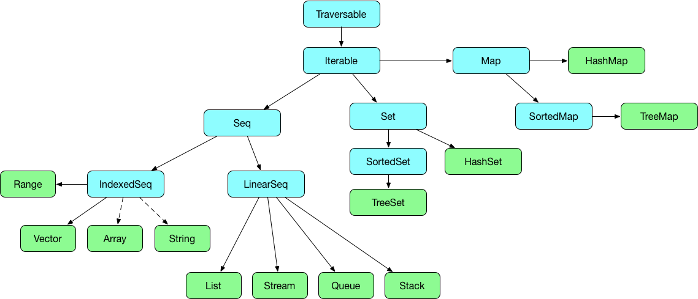

# Collections

Scala supports a wide range of collection types, including all the ones you'd expect.

Here's a diagram of the collections hierarchy, showing traits in blue and classes in green.

Functional programming tends to use standard collections, such as `Map` and `List`, rather than creating special purpose classes.

### Mutability
Before we dive into using the collections, let's take a few minutes to talk about mutability.

The concept of *mutability* is very important in functional programming, so much so that Scala provides two more or less parallel sets of collections, `scala.collection.mutable` and `scala.collection.immutable`. You'll find that the immutable versions are the default, so that when you create a `Map` you are creating a `scala.collection.immutable.Map`, and if you want a mutable `Map` you will need to qualify the name.

## Traversable and Iterable

These two traits live at the top of the hierarchy, and show clearly how Scala supports both OO and functional programming.

### Traversable
The `Traversable` trait defines `foreach`, which works like this

~~~~~~~~
scala> (1 to 5).foreach(x => println(x))
1
2
3
4
5
~~~~~~~~

You can see that `foreach` takes a function and applies it to each member of the collection in turn. Note that `foreach` does not return a value.

If you want to write less code, you can use the underscore to refer to the single lambda argument

~~~~~~~~
scala> (1 to 5).foreach(println(_))
~~~~~~~~

Or even more simply

~~~~~~~~
scala> (1 to 5) foreach println
~~~~~~~~

There are a couple of important things to note about `foreach`. The first is that, since the value passed to the lambda is immutable, you can't use it to change the collection. But of course, we're thinking about immutable collections in any case, so that shouldn't be a problem.

The second thing to note is that `foreach` implements *internal iteration*. We discussed this when talking about flow control, the concept that collection objects handle their own iteration, rather than being controlled from outside using a loop.

When applied to immutable collections, `foreach` provides functional iteration, because using it on a collection will always produce the same result.
 
### Iterable
The `Iterable` trait, on the other hand, comes from Scala's OO side, and implements the traditional [iterator design pattern](https://en.wikipedia.org/wiki/Iterator_pattern).

Those who have met iterators in other languages will know that they are commonly implemented in terms of methods such as `moveNext` and `current`, but Scala iterators have a lot more functionaity, and additionally support functional operations such as `map` and `filter`. This is one reason why you won't see experienced Scala programmers using the `hasNext` and `next` methods - the functional operations save you having to handle the iteration yourself.

Another (and more important) reason to use functional operations with iterators is that using `hasNext` and `next` introduces state, and thus makes them non-functional. When you call `next` to get a value, you're not going to get the same value as the last time you called it - that's the whole point of an iterator, but it isn't functional.

T> As with other non-functional constructs, such as using `var`, don't let iterators escape outside the function in which they're used.

## Strings and Arrays
You can see on the diagram that strings and arrays are indexed sequences, but the dashed line means that they aren't really collection types.

In many languages, strings and arrays are thought of as fundamental types, and they often have their own particular interfaces. But looked at in another way, a string is simply a sequence of characters, so why doesn't it support the same operations as a `List[Char]`?

Scala lets you treat strings and arrays as collections, so that they support the same operations as other `Seq` types. So, while `String` has its own interface (`capitalize`, `toUpper` and so on) you can also use `head` to get the first element of a `String`, or even use functional operations on it.

~~~~~~~~
scala> "abc".map(_.toUpper).filter(c => c < 'C')
res2: String = AB
~~~~~~~~

I> Note for Java developers: If you look in `scala.Predef`, you'll find that `String` is a type alias for `java.lang.String`, so Scala strings are actually Java strings. How, then, do they support operations such as `map` and `filter`? Scala extends the capabilities of strings through the use of *implicits*, which we'll cover in Chapter XXX, giving ordinary Java strings a wide range of new capabilities.

## Arrays and Ranges

You have seen arrays used in the `main` method of Scala applications:

~~~~~~~~
def main(args: Array[String])
~~~~~~~~

`Array` is a generic class, and is bounds checked. They are fixed-size, but you can of course concatenate two arrays to make a new one.

`Array` is a mutable type, which might surprise you, given that Scala defaults to immutable collections. However, `Array` provides a wrapper around Java arrays, and those are mutable.

You can create arrays using `apply` on the `Array` companion object:

~~~~~~~~
scala> val strings = Array("abc", "123", "xyz")
strings: Array[String] = Array(abc, 123, xyz)

scala> val s = strings(0)
s: String = abc

scala> val s2 = strings(3)
java.lang.ArrayIndexOutOfBoundsException: 3
~~~~~~~~

Note that (unlike most other C-family languages) Scala uses round brackets for array element access. This is for two reasons: first, square brackets are used for generics, and second, using parentheses on an object actually means calling its `apply` method, so in the example we are actually calling `strings.apply(0)`.

Since `Array` is a sequence type, it supports all the operations provided by `Seq`.

## Sequences
`Seq` (for 'sequence') is one of the most important interfaces in the Scala collections hierarchy. A *sequence* is a collection whose elements appear in a defined order, for example, a `List`. This contrasts with a collection such as `Set`, which has no concept of ordering of elements.

`Seq` has two sub-traits. An `IndexedSeq`, such as a `Vector`, provides random access to elements and a fast `length` method. A `LinearSeq`, such as a `List`, provides fast access to the head, and also has a fast `tail` operation.

`Seq` supports a lot of operations - over 100 - and it is well worth browsing the ScalaDoc for the [API](http://www.scala-lang.org/api/current/#scala.collection.Seq) to see what it can do. We'll meet a lot of these when discussing lists and other collections, but bear in mind that a lot of the functionality is provided by the base `Seq` trait.

## Lists

### Creating Lists

### Functional Operations on Lists

## Maps

## Using Iterators