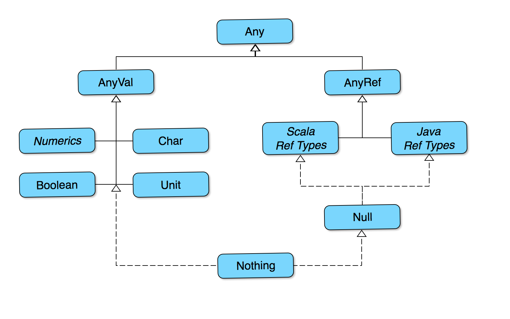

# The Type System

Now that you've seen how to create and use classes, let's take a few minutes to look at Scala's type system.

## Value and Reference Types
-- Intro to the two

### Reference Types

I> For those who know Java, `AnyRef` is equivalent to `java.lang.Object`, and so acts as the superclass for both Scala and Java reference types.

### Value Types

`AnyVal` is the base for all types that are not implemented as objects. The standard implementation includes nine value types:

   * `Byte`, `Short`, `Int`, `Long` and `Char` are the integer value types
   * `Float` and `Double` are the floating point value types
   * `Boolean` is the logical value type
   * `Unit` is the void type

### The Any Type

Uniting `AnyRef` and `AnyVal`, right at the top of Scala's type hierarchy, is `Any`.

I> Java programmers may be wondering how `Any` can be the superclass of `AnyRef`, if `AnyRef` is basically `java.lang.Object`. It is true that `Object` is the top of the hierarchy as far as JVM languages are concerned, and so `Any` is a feature of Scala alone. It is a compile-time type, and isn't present at runtime.

## Nothing and Null

Finally, we come to two rather strange types: `Nothing` and `Null`.